# AWS Database Solutions - Multi-Service Implementation


---

# AWS Database Solutions - Multi-Service Implementation

## Project Overview

Modern cloud applications require multiple database technologies to support different workloads efficiently. Rather than relying on a single database system, organizations often combine relational databases, NoSQL databases, in-memory caching, serverless computing, analytics platforms, and monitoring services to build scalable, highly available, and cost-effective architectures.

This project demonstrates the implementation of a cloud-native database solution using multiple AWS database services. The architecture combines Amazon Relational Database Service (Amazon RDS) for structured relational data, Amazon DynamoDB for NoSQL storage, Amazon ElastiCache for in-memory caching, AWS Lambda for serverless automation, and Amazon CloudWatch for monitoring and performance management.

In addition, Amazon Redshift and AWS Database Migration Service (AWS DMS) were incorporated into the overall architecture as enterprise components. Due to AWS Free Tier limitations and associated service costs, these two services were documented conceptually rather than deployed. Their intended functionality and integration are fully explained throughout this documentation and illustrated within the architecture diagram.

This implementation demonstrates how multiple AWS database technologies can be integrated into a single solution capable of supporting transactional workloads, NoSQL applications, serverless processing, caching, monitoring, and large-scale analytics.

---

# Project Objectives

The objectives of this project include:

- Design and implement a cloud-native multi-database architecture.
- Deploy a relational database using Amazon RDS.
- Store NoSQL data using Amazon DynamoDB.
- Improve application performance using Amazon ElastiCache.
- Automate database operations using AWS Lambda.
- Monitor database resources using Amazon CloudWatch.
- Understand enterprise analytics using Amazon Redshift.
- Explore database migration using AWS Database Migration Service (AWS DMS).
- Implement a scalable, highly available, and cost-conscious AWS database solution.

---

# Solution Architecture

The following architecture illustrates how all AWS services interact within the completed solution.

## Architecture Diagram

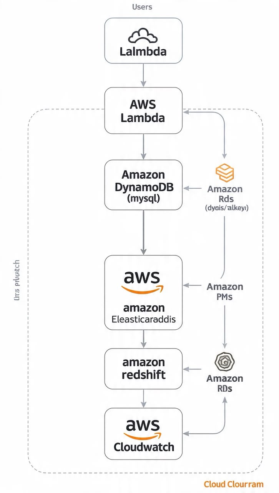

Figure 1 illustrates the complete AWS Database Solutions architecture showing the interaction between users, AWS Lambda, Amazon RDS, Amazon DynamoDB, Amazon ElastiCache, Amazon Redshift, AWS Database Migration Service (DMS), and Amazon CloudWatch.

Although Amazon Redshift and AWS DMS were not physically deployed because of AWS pricing constraints, they remain important architectural components and are included to demonstrate an enterprise-grade implementation.

---

# AWS Services Used

| Service | Purpose |
|----------|---------|
| Amazon RDS | Stores structured relational data |
| Amazon DynamoDB | Stores NoSQL key-value records |
| Amazon ElastiCache | Improves database performance using in-memory caching |
| AWS Lambda | Automates database updates |
| Amazon CloudWatch | Monitors application and database performance |
| Amazon Redshift | Enterprise data warehouse for analytics (Documented) |
| AWS Database Migration Service (DMS) | Migrates databases into Amazon RDS (Documented) |

---

# Architecture Explanation

The architecture begins when application users send requests to AWS Lambda.

Lambda processes incoming requests before interacting with the backend databases.

Structured transactional information is stored inside Amazon RDS, while flexible NoSQL records are stored within Amazon DynamoDB.

To improve application performance, frequently accessed database queries are stored temporarily inside Amazon ElastiCache, reducing repeated database calls and lowering latency.

For enterprise reporting and business intelligence, production data can be transferred into Amazon Redshift where complex analytical queries can be executed against very large datasets.

AWS Database Migration Service (DMS) provides secure migration of existing databases into Amazon RDS while supporting Change Data Capture (CDC) for continuous synchronization.

Finally, Amazon CloudWatch continuously monitors every deployed resource, collecting operational metrics, generating alarms, and helping optimize both system performance and operational costs.

---

# Prerequisites

Before implementing this project, the following requirements were met:

- An active AWS Account
- AWS Management Console access
- Internet connection
- Basic understanding of AWS database services
- AWS Free Tier account
- Web browser (Google Chrome or Microsoft Edge)

---

# Project Implementation

## Step 1: Deploying Amazon RDS

Amazon Relational Database Service (Amazon RDS) was used as the primary relational database for storing structured application data. RDS simplifies database administration by automating routine management tasks such as hardware provisioning, backups, patching, monitoring, and recovery.

For this project, a MySQL database instance was created using the AWS Management Console.

The following configurations were used:

- Database Engine: MySQL
- Deployment Type: Free Tier
- Database Identifier: `student-db`
- Master Username: `admin`
- Automated Backups: Enabled
- Public Accessibility: Enabled
- Default VPC Configuration

These configurations provide a reliable relational database suitable for application development while remaining within the AWS Free Tier.

---

### Screenshot 1 – Amazon RDS Database Configuration

The image below shows the configuration page before creating the Amazon RDS database instance.

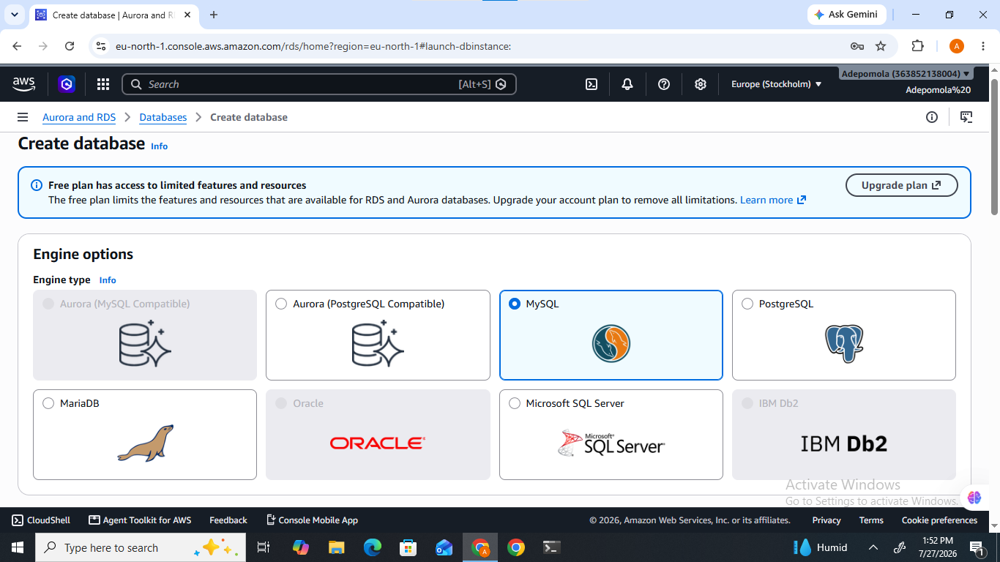

---

After reviewing the configuration settings, the database instance was successfully created.

AWS automatically provisioned the required compute resources, storage, networking configuration, and security settings.

Once provisioning was completed, the database status changed from *Creating* to *Available*, indicating that the instance was ready for use.

---

### Screenshot 2 – Amazon RDS Instance Available

The image below confirms that the RDS database instance was successfully deployed and is available for client connections.

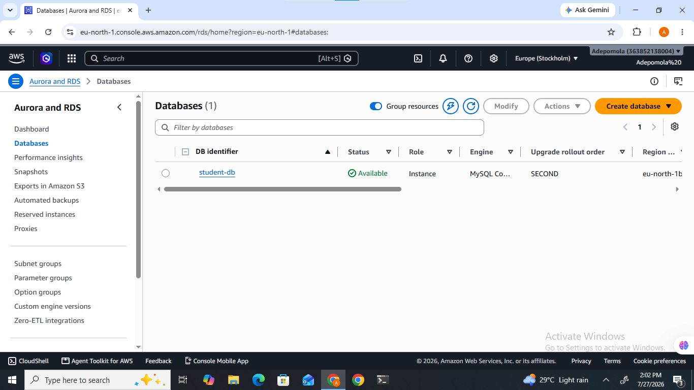

---

Amazon RDS automatically enables backup management.

Automated backups are essential for disaster recovery because they allow databases to be restored to an earlier point in time in the event of accidental deletion, corruption, or failure.

Backup retention periods and maintenance windows can also be configured according to organizational requirements.

---

### Screenshot 3 – Amazon RDS Backup Configuration

The following screenshot displays the automated backup configuration for the deployed Amazon RDS instance.

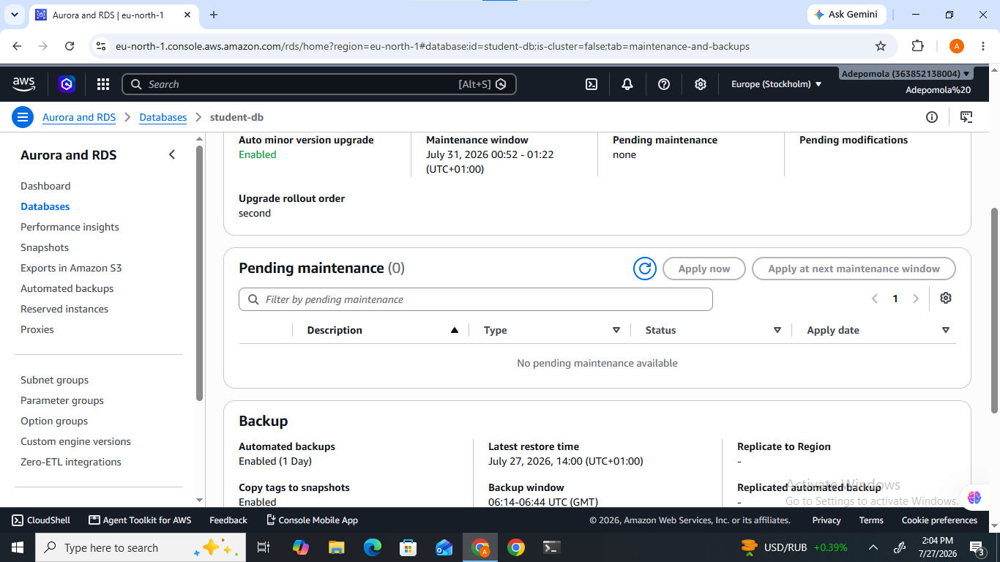

---

## Step 2: Deploying Amazon DynamoDB

Amazon DynamoDB is AWS's fully managed NoSQL database service designed for high-performance applications requiring extremely low latency and virtually unlimited scalability.

Unlike relational databases, DynamoDB stores information as key-value pairs and documents, making it ideal for modern cloud-native applications.

A DynamoDB table named *Students* was created for this implementation.

The following configuration was used:

- Table Name: Students
- Partition Key: StudentID
- Data Type: String
- Capacity Mode: On-Demand

Using On-Demand capacity allows DynamoDB to automatically scale based on application traffic without manual intervention.

---

### Screenshot 4 – DynamoDB Table Creation

The screenshot below shows the successfully created DynamoDB table.

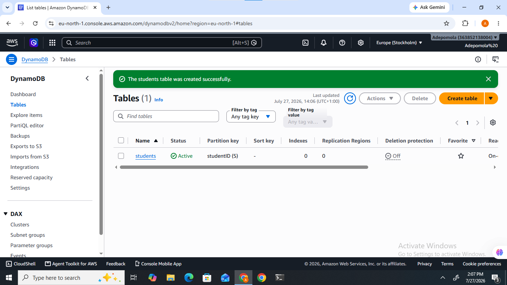

---

Sample student records were then inserted into the DynamoDB table to simulate application data.

These records demonstrate how DynamoDB stores flexible NoSQL documents while maintaining high availability and rapid access times.

---

### Screenshot 5 – Sample DynamoDB Records

The image below displays the sample records inserted into the Students table.

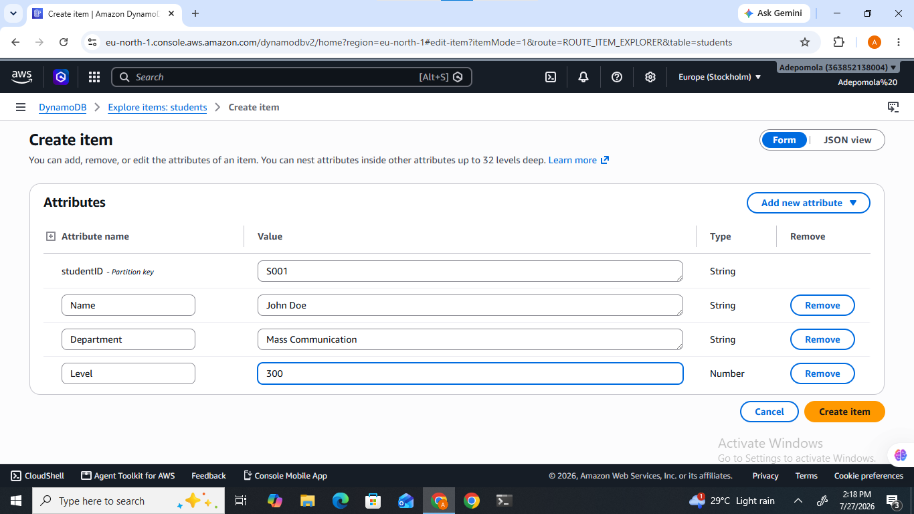

---

Finally, the table configuration was reviewed to verify that On-Demand scaling had been successfully enabled.

This feature allows DynamoDB to automatically handle increases or decreases in application workload without requiring manual capacity planning.

---

### Screenshot 6 – DynamoDB On-Demand Scaling

The following screenshot confirms that the DynamoDB table is configured to use On-Demand capacity mode.

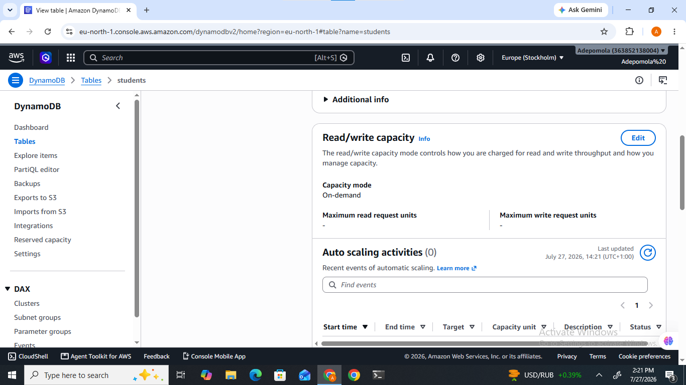

---

## Step 3: Implementing Amazon ElastiCache

Amazon ElastiCache is a fully managed in-memory caching service that improves application performance by reducing the number of direct database queries.

Instead of repeatedly retrieving frequently accessed data from Amazon RDS, applications can temporarily store commonly requested information inside a Redis or Valkey cache.

Using an in-memory cache significantly reduces response time, lowers database workload, and improves overall application scalability.

For this implementation, an Amazon ElastiCache Serverless cache was created using the following configuration:

- Engine: Valkey (Redis-compatible)
- Deployment Mode: Serverless
- Cache Name: student-cache
- Default VPC
- Default Security Configuration

The Serverless deployment model automatically manages scaling, availability, and resource allocation without requiring manual cluster management.

---

### Screenshot 7 – Amazon ElastiCache Configuration

The following image shows the cache configuration before deployment.

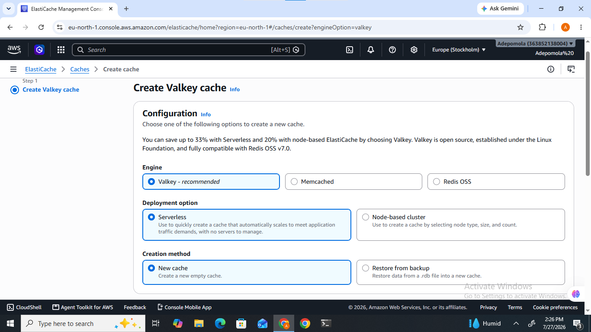

---

After deployment, AWS provisioned the cache instance and initialized the service.

Once provisioning was complete, the cache became available for application requests.

Applications can now retrieve frequently accessed data directly from the cache rather than repeatedly querying the relational database.

---

### Screenshot 8 – Amazon ElastiCache Successfully Created

The image below confirms that the Amazon ElastiCache instance was successfully deployed.

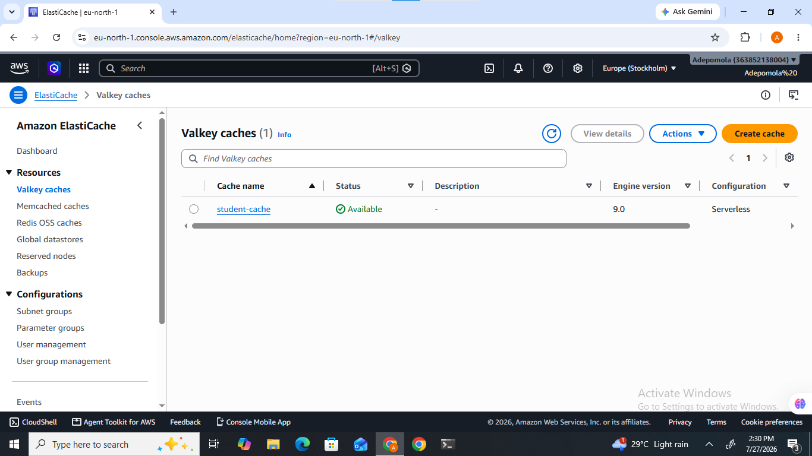

---

## Step 4: Amazon Redshift (Architecture Documentation)

Amazon Redshift is AWS's fully managed cloud data warehouse designed for large-scale analytics and business intelligence workloads.

Unlike Amazon RDS, which is optimized for transactional processing (OLTP), Amazon Redshift is optimized for Online Analytical Processing (OLAP), allowing organizations to analyze millions or billions of records efficiently.

Typical Redshift use cases include:

- Business Intelligence
- Data Warehousing
- Enterprise Reporting
- Dashboard Analytics
- Machine Learning Data Preparation

Within this project architecture, Amazon Redshift would receive structured data from Amazon RDS after transactional processing.

Analysts could then execute complex SQL queries against the warehouse without impacting the performance of the production database.

### Redshift Integration Workflow

```text
Amazon RDS
      │
      ▼
Amazon Redshift
      │
      ▼
Business Intelligence Reports
```


### Implementation Note

Amazon Redshift was *not deployed* during this project because it is *not included within the AWS Free Tier* and would incur additional charges on a personal AWS account.

Instead, its role has been documented within the project architecture and implementation guide to demonstrate how it would integrate into a production environment.

---

### Screenshot 9 – Amazon Redshift Configuration (Documentation)


---

### Screenshot 10 – Amazon Redshift Query Editor (Documentation)


---

## Step 5: AWS Database Migration Service (AWS DMS)

AWS Database Migration Service (AWS DMS) enables secure migration of databases into AWS with minimal downtime.

Organizations commonly use DMS to migrate production databases from on-premises environments or other cloud providers into Amazon RDS.

Another important capability provided by DMS is *Change Data Capture (CDC)*.

CDC continuously captures changes occurring within the source database and replicates those changes to the destination database in near real time.

### Database Migration Workflow

```text
Source Database
       │
       ▼
 AWS Database Migration Service (DMS)
       │
       ▼
 Amazon RDS
```

### Benefits of AWS DMS

- Minimal downtime
- Continuous replication
- Supports heterogeneous database migrations
- Secure encrypted data transfer
- Automatic Change Data Capture (CDC)

### Implementation Note

AWS Database Migration Service was *not deployed* because replication instances required for migration are *not covered by the AWS Free Tier* and would incur additional charges.

The migration architecture is therefore represented conceptually within the architecture diagram while maintaining the intended enterprise design.

---

## Step 6: Automating Database Operations with AWS Lambda

AWS Lambda is a serverless computing service that allows developers to execute code without provisioning or managing servers.

Instead of maintaining dedicated infrastructure, Lambda automatically executes application code in response to specific events such as HTTP requests, API Gateway events, file uploads, database updates, or scheduled tasks.

Within this project, AWS Lambda was used to simulate automated database processing. A Python-based Lambda function was created to demonstrate how serverless functions can process requests and interact with backend database services.

The function returns a successful HTTP response, confirming that the serverless environment was configured correctly.

### Lambda Function Configuration

| Configuration | Value |
|---------------|-------|
| Function Name | UpdateDatabaseFunction |
| Runtime | Python 3.x |
| Trigger | Manual Test Event |
| Response | HTTP Status Code 200 |

---

### Screenshot 11 – AWS Lambda Function Creation

The image below shows the successful creation of the AWS Lambda function.

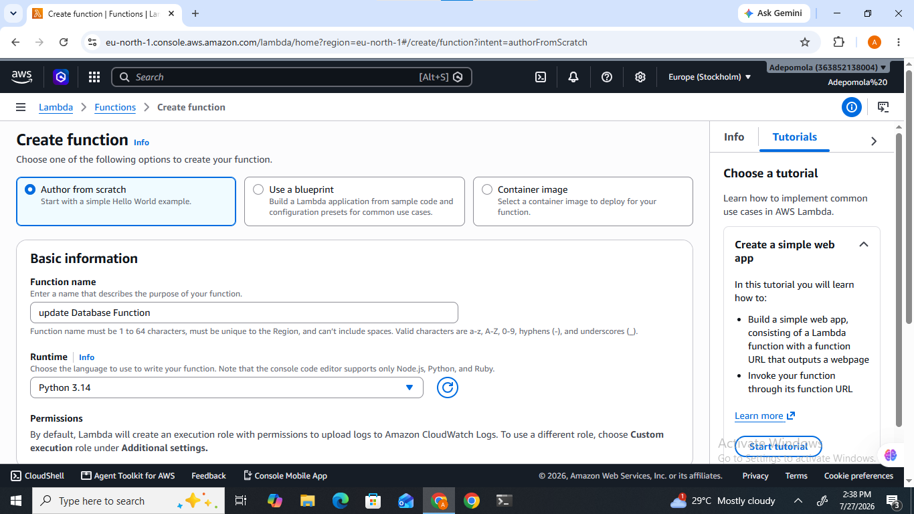

---

The default Lambda function code was replaced with a simple Python function that returns a successful response.

This verifies that the function executes correctly and can later be extended to update Amazon RDS, modify DynamoDB records, or invalidate cached objects stored in Amazon ElastiCache.

Example Python Function:

```python
import json

def lambda_handler(event, context):
    return {
        "statusCode": 200,
        "body": json.dumps("Database updated successfully!")
    }
```
---

### Screenshot 12 – AWS Lambda Function Code

The screenshot below displays the deployed Python code.

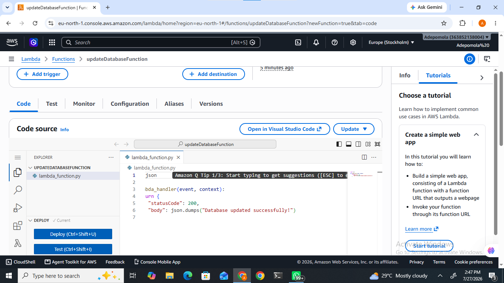

---

After deployment, a Lambda test event was created and executed.

AWS successfully invoked the function and returned an HTTP 200 status code indicating successful execution.

---

### Screenshot 13 – AWS Lambda Test Execution

The image below confirms successful execution of the Lambda function.


---

## Step 7: Monitoring Resources with Amazon CloudWatch

Amazon CloudWatch is AWS's native monitoring and observability service.

CloudWatch continuously collects operational metrics from AWS resources, allowing administrators to monitor performance, detect anomalies, and configure alarms that notify administrators whenever predefined thresholds are exceeded.

Monitoring is an essential component of cloud architecture because it enables proactive issue detection before users experience service degradation.

For this implementation, CloudWatch was used to monitor Lambda function invocations.

Metrics collected included:

- Function Invocations
- Execution Duration
- Errors
- Throttles

These metrics help evaluate serverless application performance and identify potential operational issues.

---

### Screenshot 14 – Amazon CloudWatch Metrics

The following screenshot displays the Lambda invocation metrics collected by CloudWatch.

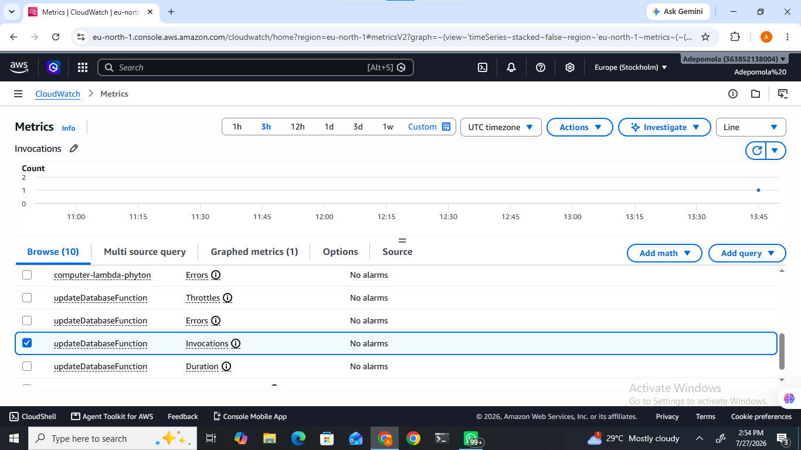

---

CloudWatch alarms provide automated monitoring by evaluating resource metrics against predefined thresholds.

If a threshold is exceeded, CloudWatch can trigger notifications through Amazon SNS or invoke automated remediation workflows.

An alarm was configured to monitor Lambda invocation activity.

---

### Screenshot 15 – Amazon CloudWatch Alarm

The screenshot below confirms the successful creation of the CloudWatch alarm.

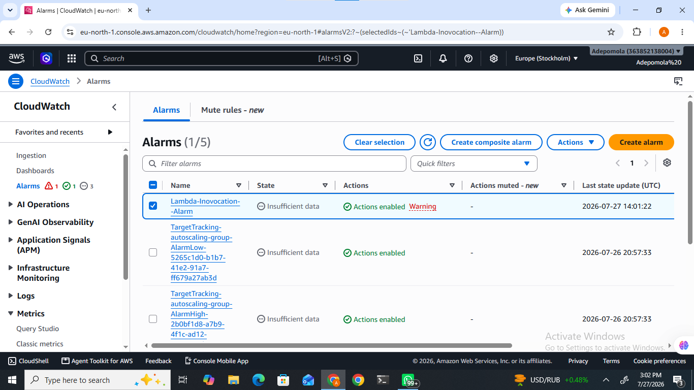

---

# Security Best Practices

The following security measures were considered throughout this project implementation:

- Principle of Least Privilege (IAM)
- Strong administrator credentials
- Automated database backups
- Default VPC security configuration
- Encryption support for managed database services
- CloudWatch monitoring for operational visibility
- Serverless execution using AWS Lambda
- Managed AWS services to reduce operational risk

These best practices improve confidentiality, integrity, availability, and operational resilience of cloud database environments.

---

# Cost Optimization

Several cost optimization strategies were considered while implementing this solution.

- AWS Free Tier eligible services were prioritized whenever possible.
- Amazon RDS was deployed using Free Tier resources.
- DynamoDB On-Demand capacity automatically adjusts to workload requirements.
- AWS Lambda only incurs charges during execution.
- CloudWatch was used for efficient operational monitoring.
- Resources were reviewed after implementation to avoid unnecessary costs.

Amazon Redshift and AWS Database Migration Service (AWS DMS) were intentionally excluded from deployment because they require paid resources beyond the AWS Free Tier. Their implementation is documented conceptually within the architecture diagram and supporting explanations to demonstrate how they integrate into an enterprise-grade database solution while avoiding unnecessary costs on a personal AWS account.

---

# Database Architecture Workflow

The implemented solution combines multiple AWS database technologies to support different application requirements.

The workflow begins when a user sends a request to the application. AWS Lambda processes the request and determines the appropriate backend service.

- Structured relational data is stored in Amazon RDS.
- Key-value and NoSQL data is stored in Amazon DynamoDB.
- Frequently accessed records are cached in Amazon ElastiCache to improve application performance and reduce database load.
- Amazon CloudWatch continuously monitors all deployed services for operational health and performance metrics.
- In a production environment, AWS DMS would migrate external databases into Amazon RDS while Amazon Redshift would receive production data for analytics and reporting.

This architecture provides scalability, flexibility, high availability, and improved application performance.

---

# Challenges Encountered

Several challenges were encountered during the implementation of this project.

## Amazon Redshift Pricing

Amazon Redshift is not included within the AWS Free Tier. Deploying a Redshift cluster would have incurred additional charges; therefore, only its architectural design and implementation strategy were documented.

## AWS Database Migration Service (AWS DMS)

AWS DMS requires replication resources that are not covered by the AWS Free Tier. To avoid unnecessary charges, the migration process was documented conceptually rather than deployed.

## AWS Console Changes

The AWS Management Console has evolved over time, resulting in differences from older tutorials. Examples include:

- Updated Amazon ElastiCache interface using Valkey Serverless.
- Updated AWS DMS interface displaying Migration Projects instead of Replication Instances.
- Updated CloudWatch navigation and metrics layout.

These changes required adapting the implementation while maintaining the project's intended objectives.

---

# Project Limitations

The following enterprise services were intentionally documented rather than deployed due to AWS pricing constraints.

| Service | Status | Reason |
|----------|--------|--------|
| Amazon Redshift | Documented | Not Free Tier eligible |
| AWS Database Migration Service (DMS) | Documented | Requires paid replication resources |

Although these services were not deployed, their architecture, purpose, data flow, and integration with the overall solution have been fully documented.

---

# Lessons Learned

This project provided practical experience in designing and implementing a cloud-native multi-database solution using AWS managed services.

Key lessons learned include:

- Designing scalable cloud database architectures.
- Deploying and managing relational databases using Amazon RDS.
- Implementing NoSQL storage using Amazon DynamoDB.
- Improving application performance with Amazon ElastiCache.
- Automating workloads using AWS Lambda.
- Monitoring cloud resources using Amazon CloudWatch.
- Understanding enterprise data warehousing with Amazon Redshift.
- Understanding database migration strategies using AWS Database Migration Service.
- Applying AWS Free Tier cost optimization practices.
- Producing professional cloud infrastructure documentation.

---

# Conclusion

This project successfully demonstrated the design and implementation of a modern AWS multi-service database architecture using managed cloud services.

Amazon RDS provided reliable relational data storage, Amazon DynamoDB delivered scalable NoSQL storage, Amazon ElastiCache improved application performance through in-memory caching, AWS Lambda automated application processing, and Amazon CloudWatch supplied operational monitoring and observability.

Although Amazon Redshift and AWS Database Migration Service (AWS DMS) were not deployed because they are outside the AWS Free Tier, both services remain essential architectural components. Their integration has been accurately documented within the solution architecture and implementation guide, providing a realistic representation of an enterprise production environment.

Overall, this project demonstrates how AWS managed database services can be combined to build secure, scalable, highly available, and cost-effective cloud-native applications while balancing functionality with cost considerations.

---

# References

- [Amazon RDS Documentation](https://docs.aws.amazon.com/rds/)
- [Amazon DynamoDB Documentation](https://docs.aws.amazon.com/amazondynamodb/)
- [Amazon ElastiCache Documentation](https://docs.aws.amazon.com/AmazonElastiCache/)
- [AWS Lambda Documentation](https://docs.aws.amazon.com/lambda/)
- [Amazon CloudWatch Documentation](https://docs.aws.amazon.com/AmazonCloudWatch/)
- [Amazon Redshift Documentation](https://docs.aws.amazon.com/redshift/)
- [AWS Database Migration Service (DMS) Documentation](https://docs.aws.amazon.com/dms/)
- [AWS Free Tier](https://aws.amazon.com/free/)
- [AWS Architecture Center](https://aws.amazon.com/architecture/)

